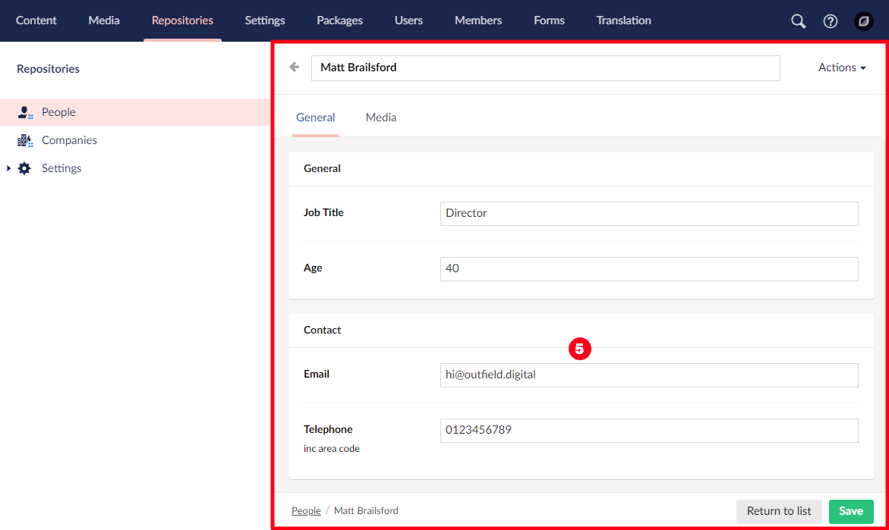
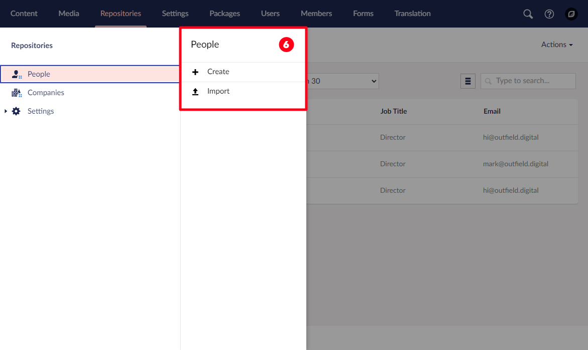
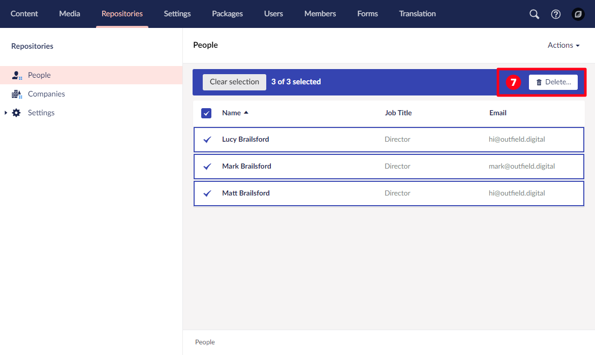

# User Interface

Before you get to know Konstrukt, you need to become familiar with the Umbraco UI and a few of it’s concepts as Konstrukt reuses these same concepts for constructing it's UI.

**1. Section** A distinct aread of the Umbraco backoffice.  
**2. Tree** A hierarchical structure to help organise a section.  
**3. Dashboard** An intro screen for a section, usually with useful links for that section.  

**4. List View** A list based view of items in a tree node.

**5. Editor** The main content editing area made up of tabs, fieldsets and fields.

**6. Menu Item** A context menu item + action.

**7. Bulk Action** An action to perform on multiple list view items at once.